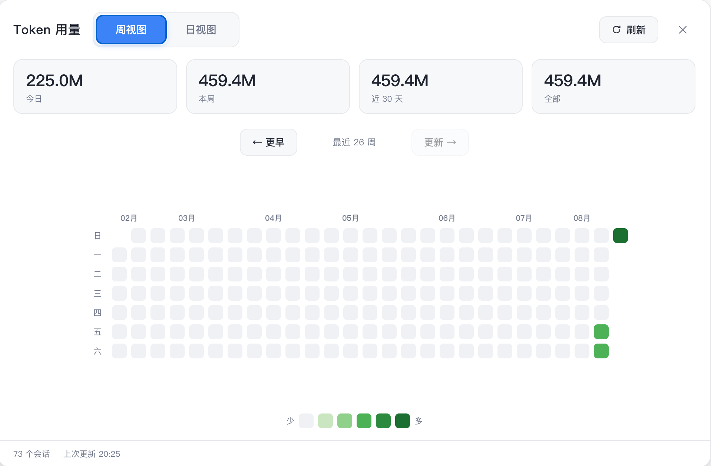
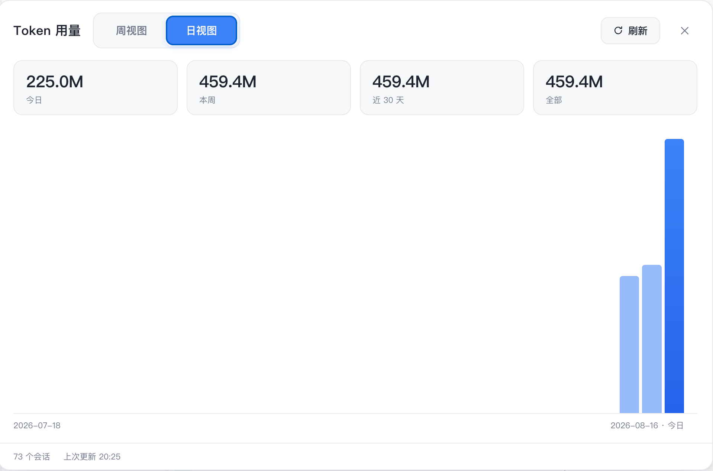

# @apodemakeles/dsh-token-dashboard

English | [中文](README.zh.md)

A DeepSeek Harness (DSH) web GUI plugin: a token-consumption heatmap panel. It shows your **total token usage per day / per week** across all projects on this machine, GitHub-contributions style. Usage facts are projected into a local SQLite database by a persistent Worker, so opening the panel never scans session logs.

> Status: **released v0.1.0** — GitHub distribution is live; npm publishing is pending the maintainer's 2FA setup.

## Screenshots

### Weekly heatmap



### Daily view



## What it does

- **Host half** — listens to live `session/event`, flushes through DSH's durability barrier, and sends minimal usage deltas to a persistent Worker. The Worker owns SQLite (`node:sqlite`), commits facts/checkpoints atomically, and serves one consistent snapshot endpoint.
- **Client half** — registers a **Token** entry in the sidebar and opens a dedicated panel rendering the heatmap (weekly grid + daily view). It fetches a single `GET /api/token-dashboard/snapshot` per open/refresh/page change.
- **CLI** — `dsh-token-dashboard status|verify|rebuild|backups|restore|cleanup` for local maintenance.

## Installation

From GitHub:

```bash
dsh plugin --profile web add github:apodemakeles/dsh-token-dashboard
```

Then **restart dsh web**. Open any project session and click the **Token** entry in the sidebar.

From npm (coming soon — once the package is published):

```bash
dsh plugin --profile web add @apodemakeles/dsh-token-dashboard
```

## Data and operations

- Projection database: `$DSH_HOME/data/token-dashboard/usage-v1.sqlite` (default `~/.dsh`).
- Total tokens = `inputTokens + outputTokens + cacheReadTokens` (cache reads count into the headline).
- The panel only calls the snapshot route; it does not trigger `listSnapshots`, `inspect`, `readFrom`, `flush`, or backfill.
- First startup initializes the database in the background; the panel shows phase/progress until `ready`.

## Development

```bash
git clone https://github.com/apodemakeles/dsh-token-dashboard.git
cd dsh-token-dashboard
pnpm install && pnpm build
dsh plugin --profile web add link:$(pwd)
```

See [.scratch/dsh-token-dashboard/map.md](.scratch/dsh-token-dashboard/map.md) for the project map (planning tracker), [docs/durable-usage-architecture.md](docs/durable-usage-architecture.md) for the architecture contract, and [docs/dev-loop.md](docs/dev-loop.md) for the full dev loop.

## Known limitations

- Projection is machine-local: it reads sessions stored on this machine (`~/.dsh/sessions` is the authority; SQLite is a rebuildable projection).
- Host/Worker changes require restarting DSH; client HMR does not cover the persistent Worker.
- SQLite is experimental in Node 24 (`node:sqlite`); the plugin checks capability at startup and does not hide the warning globally.

## License

MIT
