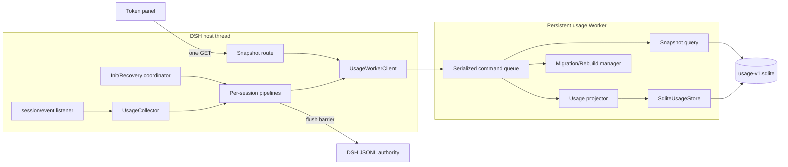
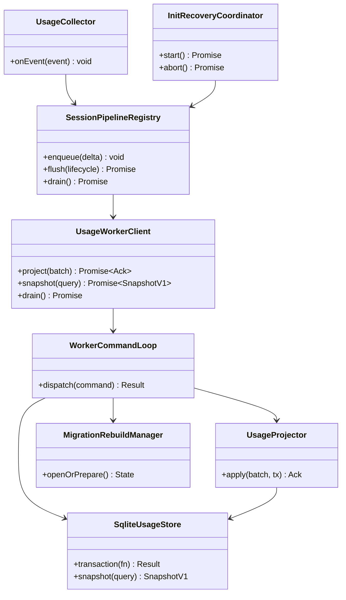
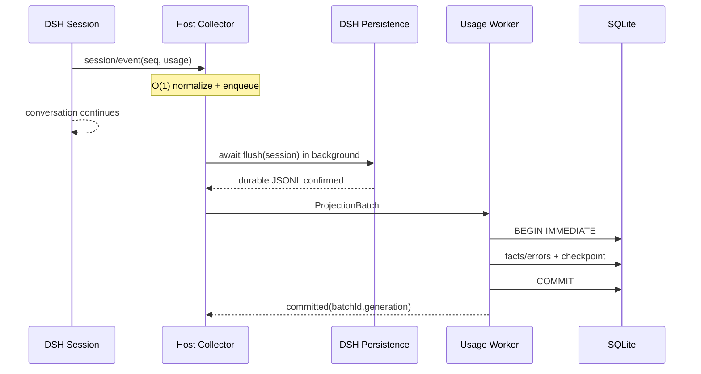
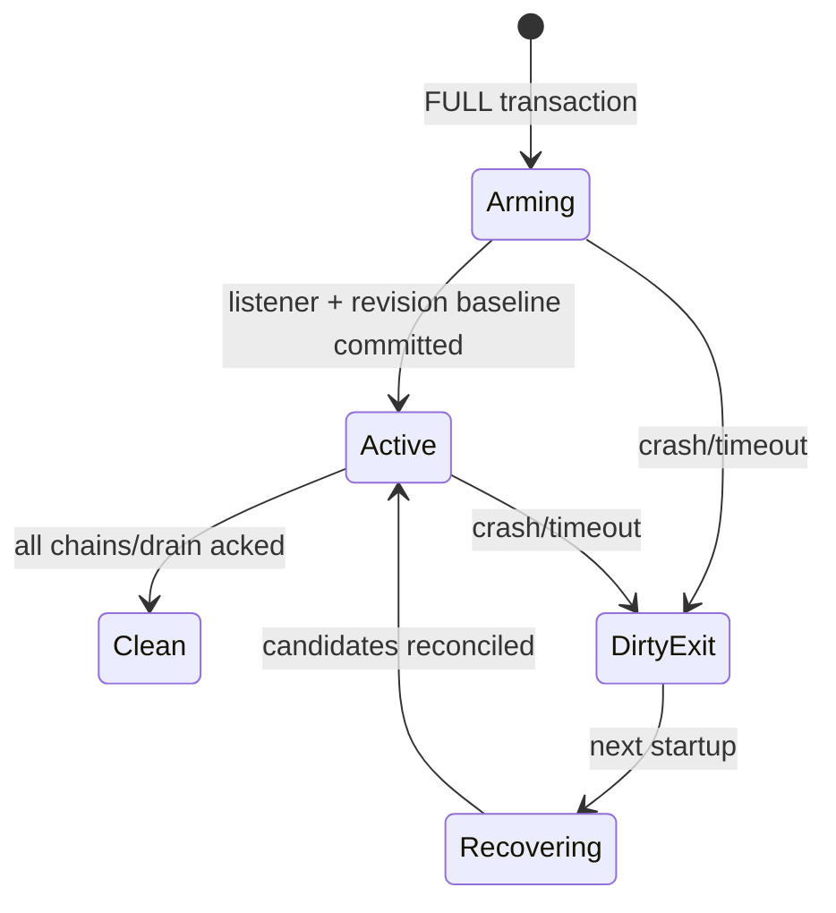
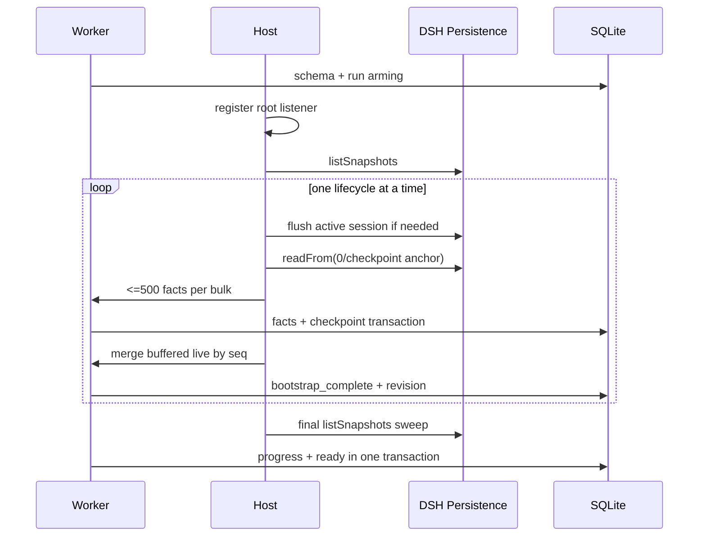
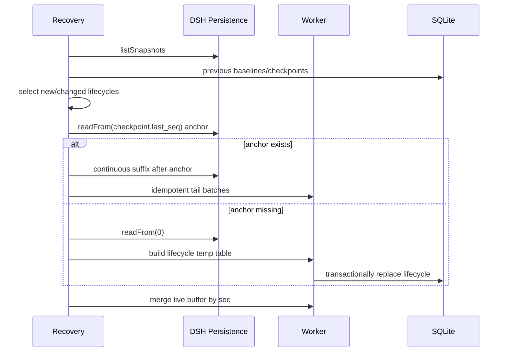

# Durable Usage Architecture

> 状态：最终稿（已确认，可进入实施）  
> 日期：2026-08-16  
> 范围：`@apodemakeles/dsh-token-dashboard` host/client/Worker/本地运维 CLI  
> 本文是架构与执行合同，不实施产品代码。

## 1. 结论

当前面板变慢与大量 subagent 高度相关，但根因不是“显示数字难算”，而是昂贵工作发生在打开面板之后：

1. client 同时请求 `/summary` 与 `/days`；
2. 两个请求都会调用 `TokenAggregator.refresh()`；
3. 进程首次打开时，对每个冷会话完整 `inspect()` 并解析会话日志；
4. 即使有内存缓存，summary/days 仍从全部 UsageSample 重建日桶；
5. 缓存只活在当前 DSH 进程，重启后丢失。

subagent 增加会话、模型步骤和压缩 JSONL 体积，会放大首次扫描、解压和折叠成本。

ZCode 3.7.7 可借鉴的不是后台日汇总，而是运行期写结构化 Usage facts 到 SQLite，面板只执行索引 SQL 并返回一个 snapshot。其本机 18,347 条 model usage、7,306 条 subagent 请求时，复刻聚合约 0.42 秒；没有证据显示它扫描 transcript 或维护日物化表。详见 [ZCode 调研](zcode-token-usage-research.md)。

最终方案：

```text
DSH session/event
  → host O(1) 最小增量入队
  → 后台 await ctx.sessions.flush(session)
  → 常驻 Worker 批量事务 UPSERT Usage facts + checkpoint
  → SQLite 永久读模型
  → 单一 /api/token-dashboard/snapshot 一致查询
```

SQLite 是可从 DSH JSONL 重建的持久投影，JSONL 仍是权威来源。对话线程永不等待 SQLite；面板不再触发日志扫描。

## 2. 目标与非目标

目标：

- 每个 `(session lifecycle, turn, step)` 持久化一条幂等 Usage fact。
- provider/model 继续作为分组维度。
- 实时写入、首次初始化、异常恢复共用同一投影语义。
- SQLite 不领先权威 JSONL。
- 打开面板只执行一次 snapshot，不触发 scan/flush/backfill。
- 初始化和恢复不阻塞 DSH 启动，UI 明确显示完整性。
- 进程异常、Worker 崩溃、ack 丢失和队列溢出后不重复计费。
- 有清晰 schema/migration/rebuild/rollback/CLI 运维边界。

非目标：

- 不改变现有 UI 布局、Token 口径、26 周翻页、本地时区或 provider/model 分类。
- 不增加日 rollup、30/90 天清理或自动 VACUUM。
- 不开放浏览器重建/删除接口。
- 不直接解析 DSH 私有 JSONL/Zstd 文件。
- 不以大量 subagent 压测验收。
- 不支持 host HMR 双实例；host/Worker 改动后重启 DSH。

## 3. 核心术语与不变量

- **Session lifecycle**：`session_id + createdAt + cwd`；同 id 删除重建属于新生命周期。
- **Usage fact**：一个生命周期、turn、step 的最新完整 Token 观察。
- **Checkpoint**：已检查、来源已持久化且 SQLite 已提交的最大连续 seq，并携带 route provider/model 游标。
- **Run epoch**：插件一次运行；只有全部工作排空后才能 clean。
- **Projection phase**：`initializing | recovering | ready | degraded | rebuild_required | error`。

必须始终满足：

1. `checkpoint.last_seq <= JSONL durable last_seq`。
2. Fact 与 checkpoint 在同一 SQLite 事务。
3. checkpoint 不跨未处理 seq；无 Usage 的事件也推进连续游标。
4. 同一 fact 只按更大/相同 `source_seq` 覆盖，不累加 chunk/message。
5. clean 时 host pending/unacked/resync 全为空。
6. complete 只能在 phase=ready 且当前 run 已 active/clean 时发布。
7. 打开面板不调用 `listSnapshots/inspect/readFrom/flush`。

## 4. 目标组件



Host：

- `UsageCollector` 同步提取 lifecycle、seq、type、time、turn/step、route 变化和 Usage 四桶；不传正文/工具数据。
- `SessionPipelineRegistry` 维护每生命周期顺序链、open batch、expected_seq、live buffer 和恢复模式。
- `UsageWorkerClient` 管 batch generation、unacked、RPC、重启/熔断、snapshot timeout 和 drain；不含 SQL。
- `InitRecoveryCoordinator` 只使用 DSH persistence seam，不知道物理文件格式。

Worker：

- 一个常驻 Node Worker 独占 `node:sqlite DatabaseSync` 和串行命令队列。
- 负责 schema/migration、projection/checkpoint、run/progress、snapshot SQL、shadow rebuild。
- 首版不拆读写 Worker，不引入 `better-sqlite3/sqlite3`。
- 构建为 `lib/usage-worker.js`，以 `new URL('./usage-worker.js', import.meta.url)` 加载并随 Git/npm 发布。

模块依赖只允许单向流动；业务状态机不依赖 HTTP 或 UI：



跨线程协议只含 `init/project/snapshot/drain/shutdown` 五类命令；所有 request/ack 带 protocol version、request id 和 host generation。未知版本、未知命令或失配 generation 必须拒绝，不做兼容猜测。

SQLite 基线：

```sql
PRAGMA application_id = 0x44544F4B; -- DTOK
PRAGMA journal_mode = WAL;
PRAGMA synchronous = FULL;
PRAGMA foreign_keys = ON;
PRAGMA busy_timeout = 5000;
```

## 5. 数据模型

```sql
CREATE TABLE session_lifecycle (
  lifecycle_pk          INTEGER PRIMARY KEY,
  session_id            TEXT NOT NULL,
  session_created_at_ms INTEGER NOT NULL CHECK (session_created_at_ms >= 0),
  cwd                    TEXT NOT NULL,
  discovered_at_ms      INTEGER NOT NULL CHECK (discovered_at_ms >= 0),
  UNIQUE (session_id, session_created_at_ms, cwd)
);

CREATE TABLE usage_fact (
  lifecycle_pk       INTEGER NOT NULL
                       REFERENCES session_lifecycle(lifecycle_pk) ON DELETE RESTRICT,
  turn               INTEGER NOT NULL CHECK (turn >= 0),
  step               INTEGER NOT NULL CHECK (step >= 0),
  source_seq         INTEGER NOT NULL CHECK (source_seq >= 0),
  occurred_at_ms     INTEGER NOT NULL CHECK (occurred_at_ms >= 0),
  provider           TEXT,
  model              TEXT,
  input_tokens       INTEGER NOT NULL DEFAULT 0 CHECK (input_tokens >= 0),
  output_tokens      INTEGER NOT NULL DEFAULT 0 CHECK (output_tokens >= 0),
  cache_read_tokens  INTEGER NOT NULL DEFAULT 0 CHECK (cache_read_tokens >= 0),
  cache_write_tokens INTEGER NOT NULL DEFAULT 0 CHECK (cache_write_tokens >= 0),
  PRIMARY KEY (lifecycle_pk, turn, step)
) WITHOUT ROWID;
CREATE INDEX usage_fact_occurred_at_idx ON usage_fact(occurred_at_ms);

CREATE TABLE session_checkpoint (
  lifecycle_pk       INTEGER PRIMARY KEY
                       REFERENCES session_lifecycle(lifecycle_pk) ON DELETE RESTRICT,
  last_seq           INTEGER NOT NULL DEFAULT -1 CHECK (last_seq >= -1),
  route_provider     TEXT,
  route_model        TEXT,
  bootstrap_complete INTEGER NOT NULL DEFAULT 0 CHECK (bootstrap_complete IN (0, 1)),
  source_revision    TEXT,
  updated_at_ms      INTEGER NOT NULL CHECK (updated_at_ms >= 0),
  CHECK (bootstrap_complete = 0 OR source_revision IS NOT NULL)
) WITHOUT ROWID;

CREATE TABLE ingestion_error (
  lifecycle_pk     INTEGER NOT NULL
                     REFERENCES session_lifecycle(lifecycle_pk) ON DELETE RESTRICT,
  source_seq       INTEGER NOT NULL CHECK (source_seq >= 0),
  event_type       TEXT,
  reason_code      TEXT NOT NULL,
  detail           TEXT NOT NULL,
  first_seen_at_ms INTEGER NOT NULL CHECK (first_seen_at_ms >= 0),
  PRIMARY KEY (lifecycle_pk, source_seq)
) WITHOUT ROWID;

CREATE TABLE projection_state (
  singleton_id        INTEGER PRIMARY KEY CHECK (singleton_id = 1),
  projection_version  INTEGER NOT NULL,
  phase               TEXT NOT NULL CHECK (
                        phase IN ('initializing','recovering','ready','degraded',
                                  'rebuild_required','error')
                      ),
  discovered_sessions INTEGER NOT NULL DEFAULT 0 CHECK (discovered_sessions >= 0),
  completed_sessions  INTEGER NOT NULL DEFAULT 0 CHECK (completed_sessions >= 0),
  scanning_sessions   INTEGER NOT NULL DEFAULT 0 CHECK (scanning_sessions >= 0),
  retrying_sessions   INTEGER NOT NULL DEFAULT 0 CHECK (retrying_sessions >= 0),
  failed_sessions     INTEGER NOT NULL DEFAULT 0 CHECK (failed_sessions >= 0),
  started_at_ms       INTEGER,
  completed_at_ms     INTEGER,
  last_error_code     TEXT,
  last_error_message  TEXT,
  updated_at_ms       INTEGER NOT NULL CHECK (updated_at_ms >= 0),
  CHECK (completed_sessions + failed_sessions <= discovered_sessions)
);

CREATE TABLE run_epoch (
  epoch_id      INTEGER PRIMARY KEY AUTOINCREMENT,
  started_at_ms INTEGER NOT NULL CHECK (started_at_ms >= 0),
  state         TEXT NOT NULL CHECK (state IN ('arming','active','clean')),
  clean_at_ms   INTEGER
);

CREATE TABLE run_baseline (
  epoch_id        INTEGER NOT NULL REFERENCES run_epoch(epoch_id) ON DELETE CASCADE,
  lifecycle_pk    INTEGER NOT NULL REFERENCES session_lifecycle(lifecycle_pk) ON DELETE RESTRICT,
  source_revision TEXT NOT NULL,
  PRIMARY KEY (epoch_id, lifecycle_pk)
) WITHOUT ROWID;
```

口径：

- 缺失 Token 桶转 0；负数、小数或超安全整数写 `ingestion_error`。
- `totalTokens = input + output + cacheRead`；不持久化 total；cacheWrite 不进入当前 headline。
- 时间只存 epoch ms，查询时按机器当前本地时区切日。
- provider/model 允许 NULL，显示为 unknown；新事件只以非空值覆盖旧归属。
- 确定性坏事件隔离并推进 checkpoint；flush/Worker/SQLite 临时失败不推进。

UPSERT：

```sql
ON CONFLICT (lifecycle_pk, turn, step) DO UPDATE SET
  source_seq         = excluded.source_seq,
  occurred_at_ms     = excluded.occurred_at_ms,
  provider           = COALESCE(excluded.provider, usage_fact.provider),
  model              = COALESCE(excluded.model, usage_fact.model),
  input_tokens       = excluded.input_tokens,
  output_tokens      = excluded.output_tokens,
  cache_read_tokens  = excluded.cache_read_tokens,
  cache_write_tokens = excluded.cache_write_tokens
WHERE excluded.source_seq >= usage_fact.source_seq;
```

## 6. 实时写入、批处理与 Ack

```text
ProjectionBatch
  batch_id + host_generation
  lifecycle identity
  from_seq / to_seq
  relevant_deltas[]
```

无关事件只推进连续 seq 范围。Host 每会话在最终 Usage message、turn/end、250ms 空闲、1s 最大年龄或 64 个相关 delta 时关闭批次。来源 flush 成功后发送 Worker；Worker 跨会话最多等待 250ms 或 128 fact updates。snapshot/drain 强制提交。



Host 按 `(batch_id,host_generation)` 保留 unacked。Worker crash 最多按 100ms、1s、5s 重启三次。重投时整体旧于 checkpoint 则 no-op，部分重叠裁前缀，连续后缀处理，存在 gap 则 resync。确定性错误或三次失败后熔断，run 保持非 clean。

投影核心伪代码：

```ts
onCommittedEvent(event) {
  delta = normalizeMinimalDelta(event) // synchronous, no I/O
  pipelines.enqueue(delta)
}

async closeHostBatch(batch) {
  await dsh.sessions.flush(batch.session)
  unacked.put(batch.id, batch)
  ack = await worker.project(batch)
  unacked.removeOnlyIfGenerationMatches(ack)
}

worker.project(batch) {
  transaction(() => {
    checkpoint = loadCheckpoint(batch.lifecycle)
    suffix = requireContinuousSuffixOrNoop(batch, checkpoint)
    upsertFactsAndErrors(suffix)
    advanceCheckpointTo(suffix.toSeq, suffix.routeCursor)
    incrementCommitGeneration()
  })
  return committedAck()
}
```

`flush()` 成功只证明来源可读；只有 Worker COMMIT 后才可 ack。Host 收到 ack 前不得丢弃批次，generation 不匹配的迟到 ack 不得清理新 Worker 的 pending。

目标延迟：最终 message 约 `≤250ms + commit`；只有 chunk 约 `≤500ms + commit`。

## 7. 背压与降级

| 条件 | 行为 |
|---|---|
| delta <4096 | 正常 250ms 合批 |
| delta >=4096 | Worker 取消等待，连续提交 |
| delta >=16384 | 停止无限保留，记录 lifecycle，phase=degraded/resync_required |
| 受影响集合也溢出 | global overflow，恢复时全会话 revision 比对 |

压力解除后 `flush → readFrom(checkpoint+1)`。JSONL 是溢出恢复日志，不增加第二份 journal。

单会话 flush 失败按 100ms、1s、5s 重试，三次后 30 秒冷却；其他会话继续。成功后从 JSONL 尾部重新对齐。

## 8. Run 与关闭



启动必须在实时 admission 前可靠写 arming，并在 DSH 接受 turn 前完成 listener 注册；这是集成门禁。run 未 active 时不得发布 complete。

唯一 async disposer 的正常预算 4 秒：

1. `accepting=false` 并注销 listener；
2. 关闭 open batches；
3. 等待 per-session flush/index chains；
4. Worker 强制提交并 ack；
5. pending/unacked/resync 全空后，最后一个事务标记 clean；
6. 关闭 DB/Worker。

失败或超时不得 clean。致命异常的 DSH 强退可能短于 4 秒，只会产生安全的假 dirty。

## 9. 首次初始化

全历史扫描只在缺库、phase=initializing 续跑或明确 rebuild generation 运行。ready 启动、面板和 snapshot 均不触发。



- 历史扫描并发 1；每 500 events/一个会话 yield；live 达 soft pressure 时暂停。
- `readFrom` 可能因单个 Zstd frame 短暂占用 host；首版不绕过 DSH API。
- 进度只报 discovered/completed/scanning/retrying/failed/pendingLiveBatches，不承诺单调百分比或 ETA。
- 单会话 read 按 1s、5s、30s 重试；损坏后隔离，整体 degraded。
- 正常关闭可 abort 初始化并保持 run clean；projection 仍 initializing，下次续跑。

ready 门禁：队列空、final sweep 完成、全部 bootstrap complete、failed=0、初始化 batch 全 ack、live buffer 已交接，且当前 run active。最终进度、completed_at、ready 在一个事务写入。

## 10. 异常恢复

上一 epoch=active：只恢复相对其 baseline 新增或 revision 变化的生命周期。上一 epoch=arming：baseline 可能不完整，退化为全部当前生命周期。恢复不阻塞启动，最多并行 2 个会话；受影响会话缓存 live，其他会话继续。



完全消失的 session 保留永久 facts；同一生命周期仍存在但锚点证明重写时才局部替换。

| 中断点 | 结果 |
|---|---|
| JSONL durable，SQLite 未提交 | revision + checkpoint 尾部恢复 |
| SQLite COMMIT，ack 未送达 | checkpoint 裁前缀，幂等重投 |
| host/Worker 队列溢出 | JSONL resync |
| 事件仅在 DSH 内存，尚未 JSONL durable | 插件无法恢复 |

## 11. Snapshot API

```http
GET /api/token-dashboard/snapshot?weeks=26&offsetWeeks=0
Cache-Control: no-store
```

- weeks 默认 26，范围 1～52；offsetWeeks 默认 0，范围 0～10000。
- 固定机器本地时区；无 tz、模型 filter 或 fact cursor。
- summary 始终为 today/7d/30d/all；days 和顶层 byModel 对应请求窗口。
- 每日模型 Top 3 + other；窗口 Top 100 + tail 汇总。

```ts
interface SnapshotV1 {
  contractVersion: 1
  asOf: { committedAtMs: number; commitGeneration: number; stateGeneration: number }
  query: {
    weeks: number; offsetWeeks: number; timezone: 'local'
    fromDate: string; toDate: string
  }
  projection: {
    phase: 'initializing' | 'recovering' | 'ready' | 'degraded'
    complete: boolean
    pendingBatches: number
    progress: {
      discoveredSessions: number; completedSessions: number
      scanningSessions: number; retryingSessions: number; failedSessions: number
      startedAtMs: number | null; completedAtMs: number | null
    }
  }
  summary: {
    today: number; week: number; month30: number; all: number
    cacheReadAll: number; sessionCount: number
  }
  days: TokenDayBucketV1[]
  byModel: { items: ModelBucket[]; otherModelCount: number; otherModelTokens: number }
  warnings: { count: number; byCode: Array<{ code: string; count: number }> }
}
```

ready/initializing/recovering/degraded 返回 200，后三者 complete=false。rebuild_required/error/Worker unavailable/timeout/numeric overflow 返回 503；bad query 返回 400。浏览器不接收路径、正文或 stack。

Worker：先提交已接收 writes，再开一个读事务查询 state/summary/days/models/warnings，commit 后补零并组装。结果可落后仍在 host flush 的一个正常批次，但内部不撕裂。

Host 合并同参数 RPC，LRU 最多 8 个结果；key 包含 query、commit generation、state generation、本地日期。提交/状态变化/跨日失效。HTTP 超时 5 秒，不强杀同步 SQL。

## 12. 路径、迁移、重建与 CLI

```text
$DSH_HOME/data/token-dashboard/
  usage-v1.sqlite
  usage-v1.rebuild-<uuid>.sqlite
  usage-v1.backup-<timestamp>.sqlite
  usage-v1.corrupt-<timestamp>.sqlite
  rebuild-intent.json
```

缺省 DSH_HOME=`~/.dsh`；目录 0700、文件 0600；不开放自定义路径。一个 DSH Home 只允许一个 owner；第二 web 进程/CLI 写命令返回 `database_in_use`，不依赖永久普通 lock file。

版本：

- application_id：数据库身份。
- user_version：可事务迁移 DDL。
- projection_version：JSONL→fact 语义，不兼容必须重建。
- newer DB/foreign application id：拒绝写，不降级、不重建。

正常启动不跑全库 integrity_check。新库/shadow 晋升前 quick_check；明确 CORRUPT/NOTADB 后确认；CLI 可 full verify。权限、ENOSPC、BUSY、临时 I/O 不误判 corruption。

Shadow rebuild：旧 canonical 不动，原子发布 owner-only intent；shadow 复用 init/live 并作为重建期 snapshot 来源。ready 后 drain、checkpoint WAL、close、校验，再 canonical→backup、shadow→canonical，每步 directory fsync。

启动依据 intent 唯一恢复：目标 canonical ready→收尾；唯一有效 shadow→晋升；shadow 无效且唯一 backup 有效→恢复；无法唯一证明→maintenance_required。首版不自动删除 backup/corrupt、不自动 VACUUM。

```text
dsh-token-dashboard status
dsh-token-dashboard verify [--full]
dsh-token-dashboard rebuild
dsh-token-dashboard backups
dsh-token-dashboard restore <exact-basename>
dsh-token-dashboard cleanup <exact-basename>
```

写命令要求 DSH 停止并取得 owner。rebuild 只写 intent；restore 先备份当前库；restore/cleanup 严格 basename 和二次确认，拒绝目录、glob、symlink escape 和自动“最新”。浏览器无 mutation endpoint。

## 13. 故障矩阵

| 故障 | Phase/HTTP | 自动动作 | 保证 |
|---|---|---|---|
| 单会话 flush 失败 | degraded/200 partial | 3 次退避、30s 冷却、tail resync | 不推进 checkpoint |
| Worker 退出 | degraded/200 partial | 3 次退避、重投 | commit/ack 幂等 |
| Worker 三次失败 | error/503 | 熔断，等下次启动 | run dirty |
| 初始化单文件损坏 | degraded/200 partial | 隔离、下次重试 | 不伪装完整 |
| 坏 Usage 字段 | ready+warning/200 | ingestion_error，继续 | 已追平可处理来源 |
| DB/schema too new | error/503 | 拒绝写 | 不破坏新库 |
| Projection mismatch | initializing/200 partial | shadow rebuild | 旧库备份 |
| SQLite corruption | rebuild/error | 隔离 DB/WAL/SHM | 不直接删除 |
| Queue overflow | degraded/200 partial | revision/tail resync | 内存有界 |
| Snapshot >5s | 503 retryable | SQL自然结束 | 不强杀 DB |
| Shutdown >4s | 下次 recovering | 不写 clean | 安全假 dirty |

## 14. 安全与隐私

- Host→Worker 只传最小 Usage/route delta。
- ingestion error 有界，不存原始事件。
- DB/backup/intent owner-only；路径不来自浏览器。
- API/CLI 不输出正文、内部绝对路径或 stack。
- CLI mutation 禁止 active owner、glob、目录和 symlink escape。
- 首版无外部 telemetry 或后台上传。

## 15. 十步实施计划

详细门禁见 [票据 08](../.scratch/durable-usage-architecture/issues/08-execution-sequence-and-verification.md)。

1. 共享合同与纯 projector。
2. SQLite schema/repository/query。
3. Worker entry/protocol/package。
4. UsageWorkerClient、ack/restart/drain。
5. 实时 collector、flush、两级队列/背压。
6. 初始化、run epoch、异常恢复。
7. migration/shadow rebuild/CLI。
8. Snapshot route/client 适配，不切换。
9. 一次性 runtime/client cutover，删除旧扫描。
10. README/dev-loop/生成物/发布验收。

Commit 1～8 不接入 root；Commit 9 是行为切换与主要回滚点。每个提交结束 typecheck/test/build 通过，不发布半套协议。

## 16. 验证与验收

故障覆盖：flush 前后、commit/ack、arming/active crash、初始化 abort/live race、overflow、锚点缺失、shutdown timeout、shadow promotion 每一步、owner 竞争、too-new/foreign/corrupt/permission/ENOSPC。每项断言不重复、checkpoint 不越界、错误不伪装 ready、旧库不误删。

真实等价：只读真实 sessions、写临时 SQLite；以当前旧 fold/day-bucket 和 `input+output+cacheRead` 为 oracle，逐 fact/summary/day/model/requests/sessionCount 比较；重放两次结果不变。不输出正文、不改正式数据。

不运行大量 subagent，使用真实只读副本和直接生成 facts 的 fixture：

| 指标 | 门禁 |
|---|---:|
| session/event normalize+enqueue | p99 <1ms，0 I/O |
| 128 facts FULL transaction | 本机 p95 <100ms |
| 当前真实语料 snapshot | p95 <500ms |
| 100k facts、26周 snapshot | p95 <2s |
| generation cache hit | p95 <10ms |
| host delta | 永不超过 16384 |

发布必须验证 `lib/index.js`、`lib/client.js`、`lib/usage-worker.js`、CLI、declarations/sourcemaps，client 仍以 `window.__ModuleLoader__.load` 注册，Git/npm artifact 实际包含 Worker/CLI。link 安装后重启 DSH 验证初始化、刷新、翻页、正常/异常重启和 CLI owner；打开面板 trace 证明无 snapshots/readFrom。

## 17. 可观测性

本地结构化指标：phase、generations、pending/overflow、flush/commit/snapshot/readFrom latency、batch size、retry/restart/resync、初始化计数、warning codes、DB/WAL/shadow/backup size、rebuild step、shutdown 阶段耗时和 clean/dirty。

日志不得包含完整 event、prompt 或 tool payload。CLI status 是主要诊断入口；首版不上传 telemetry。

## 18. 原型评审

Throwaway 原型：[说明](../.scratch/durable-usage-architecture/prototype/README.md)。

```bash
node .scratch/durable-usage-architecture/prototype/tui.mjs
node .scratch/durable-usage-architecture/prototype/tui.mjs --scenario all
```

已执行：正常 clean、JSONL 后/SQLite 前崩溃、COMMIT 后/ack 前崩溃、初始化/live race、overflow/resync、shutdown timeout。补强后全部通过核心不变量。

原型发现并固化两个门禁：

1. 当前 run 仍 arming 时不得发布 complete；baseline 提交进入 active 后才允许。
2. 初始化/恢复处理连续事件范围，不是只处理 Usage 事件；否则 checkpoint 可能跨 gap。

## 19. 已知限制与延期条件

- JSONL backend 的逻辑 tail read 物理上可能解析整文件，但只发生初始化、异常恢复或 resync，不在面板路径。
- `node:sqlite` 在本机 Node 24.14 仍发 ExperimentalWarning；不全局屏蔽，启动做能力检查。
- 首版全历史 summary/byModel 仍是 SQL 聚合。只有 100k facts 门禁失败或生产 snapshot 接近 5 秒时才单独设计日 rollup；不得回退扫描 JSONL。
- 单 owner 意味着同一 DSH Home 的第二 web 进程不能同时提供写服务。
- 事件尚未进入 JSONL即硬中断，插件无法恢复。

## 20. 设计来源

- [DSH 事件与生命周期研究](../.scratch/durable-usage-architecture/research/01-dsh-event-lifecycle-contract.md)
- [SQLite Worker 研究](../.scratch/durable-usage-architecture/research/02-sqlite-worker-runtime.md)
- [Usage fact schema](../.scratch/durable-usage-architecture/issues/03-usage-fact-schema-and-query.md)
- [异步写回与恢复](../.scratch/durable-usage-architecture/issues/04-write-behind-and-recovery-state-machine.md)
- [首次初始化](../.scratch/durable-usage-architecture/issues/05-initialization-scan-contract.md)
- [Snapshot API](../.scratch/durable-usage-architecture/issues/06-snapshot-api-contract.md)
- [迁移、重建与运维](../.scratch/durable-usage-architecture/issues/07-rebuild-migration-and-operations.md)
- [实施与验证](../.scratch/durable-usage-architecture/issues/08-execution-sequence-and-verification.md)

本文是实施主合同；若分票据与本文冲突，以本文为准。
